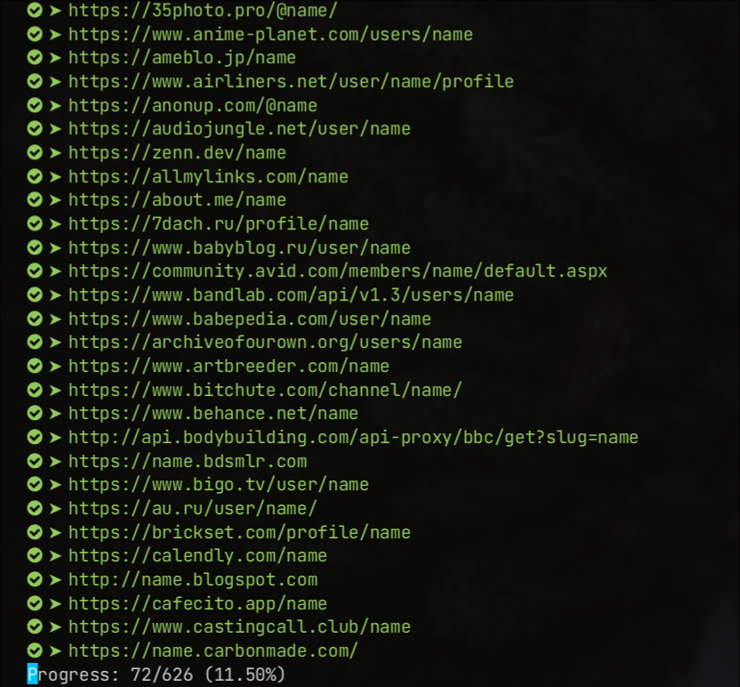

## WMN ARC DB

- [ ] function to update wmn-data.json
- [ ] argparse
- [ ] search by cat
- [x] fix progress bug
- [ ] make better error code (no lol)
- [x] use also m_string to verify url
- [x] multiThreading with threading
- [x] update function
- [x] opti threading
- [x] opti requests

## Installation

```shell
pip install -r requirements.txt
```

## Usage

```shell
python core.py john
```

## Screenshot


